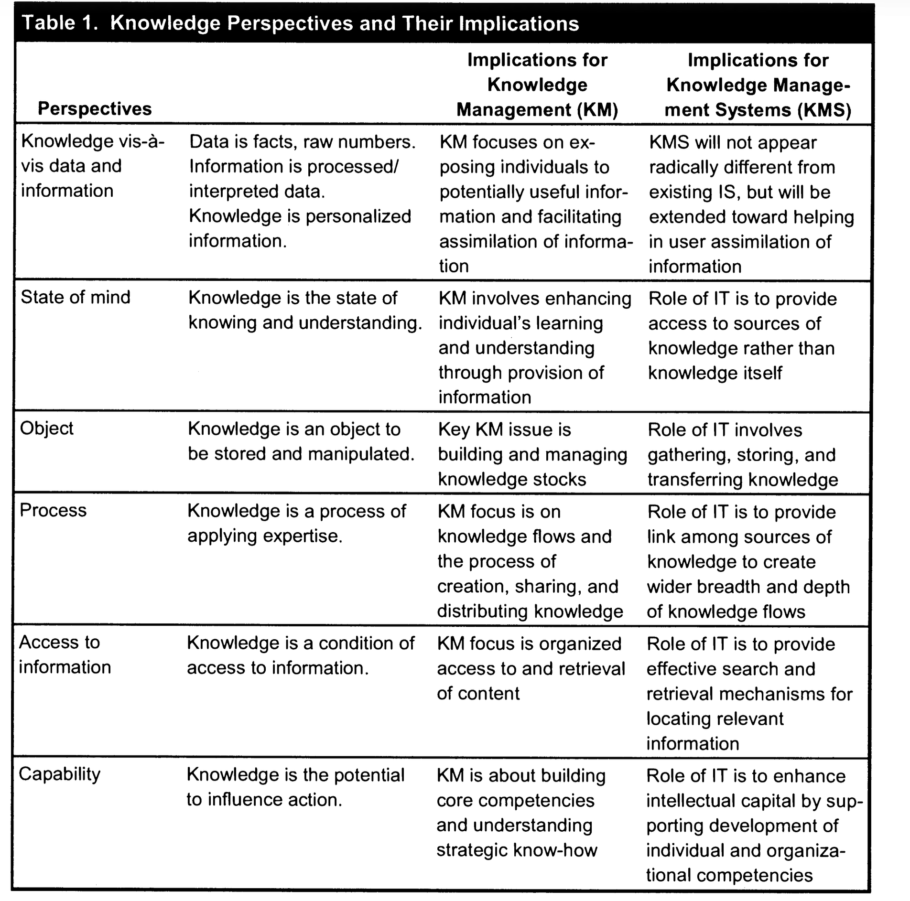
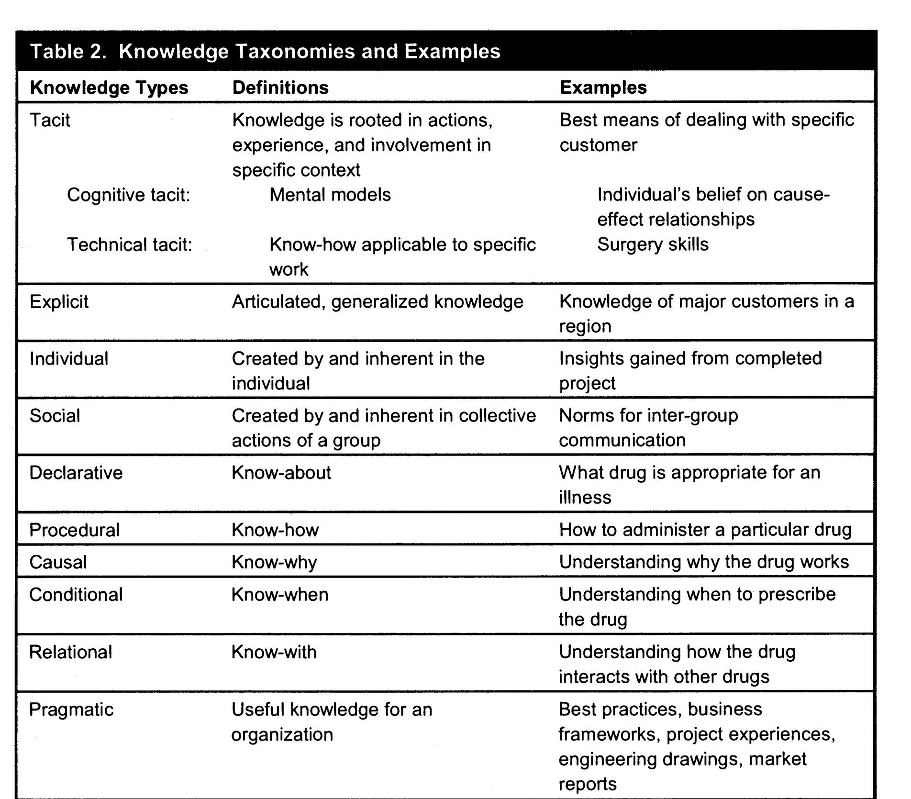

:PROPERTIES:
:ID:       id-20260625-113321
:END:
#+created: 2026-06-25T113310
#+filetags: :dmgTodo:

* PROJ 2026 agent info tours and software contractors
DEADLINE: <2026-12-31 Thu>
:PROPERTIES:
:ID: proj-2026-agent_info_tours
:CREATED:  2026-06-25 11:33:29
:END:

- how to manage the information created in the age of agents.
- Cognitive tours
- at this point, brainstorming of ideas of where we might go.

** Summary of Notes and other :ignore:
:PROPERTIES:
:CREATED:  2026-06-25 11:33:29
:END:

#+columns: "%PRIORITY(P) %60ITEM(Heading) <2026-06-25 Thu 11:33>ODO %Scheduled"
#+BEGIN: columnview :link t :id global :indent t  :match "-TODO=\"DONE\"-TODO=\"CANCELLED\"-TODO=\"NEXT\"-TODO=\"TODO\"-ignore"
#+END

** Summary of Actions :ignore:
:PROPERTIES:
:CREATED:  2026-06-25 11:33:29
:END:

#+BEGIN: columnview :link t :id global  :indent t :format "%PRIORITY(P) %60ITEM(Heading) <2026-06-25 Thu 11:33>ODO %Scheduled" :match "/TODO|NEXT" 
#+END

** TODO start
:PROPERTIES:
:CREATED:  2026-06-25 11:33:29
:END:

- [1/6] check list
  - [X] add deadline
  - [ ] add summary
    - [ ] do a brain dump
  - [ ] create an outline and project plan
  - [ ] 3 tasks to be done
    - [ ] is there a next?
  - [ ] add related links
  - [ ] move this to completed task  

** Plan
:PROPERTIES:
:CREATED:  2026-06-25 11:33:29
:END:

this is a bullet list of main things to do be done

- [ ] discussion and planning a path forward

** TODO Shutdown
:PROPERTIES:
:CREATED:  2026-06-25 11:33:29
:END:
 - [/] checklist
    - [ ] Move to areas and resources where appropriate
    - [ ] Review goals and mark as complete
    - [ ] Archive as FPROJ

** Related links
:PROPERTIES:
:CREATED:  2026-06-25 11:33:29
:END:

- tiago's organization of files in his life
  https://www.youtube.com/watch?v=A0pdL3MS_7E

- chatgpt 

https://chatgpt.com/g/g-p-6a36e2faa3cc81918431328ebe04bb2b-software-contractors/project

** Resources and files
:PROPERTIES:
:CREATED:  2026-06-25 11:33:29
:END:

** ACTIONS
:PROPERTIES:
:CREATED:  2026-06-25 11:33:29
:END:

** Log
:PROPERTIES:
:CREATED:  2026-06-25 11:36:53
:END:

*** [2026-06-25 Thu]
:PROPERTIES:
:CREATED:  2026-06-25 11:36:53
:END:

- human responsible and accountable
- Cognitive control
  - share understanding across the team.
- many tools but fragmented
- information is there but not the level of abstraction
  - not actionable for a particular goal
  - need for "tours-on-demand"
  - need to query
- shifting from the file system to knowledge entities and structure
- person vs team
  - team is more about accountability
  - person responsibility

- terminology overloading
- automatically created info
  - traces
  - source being created
  - plans
- tacit with respect to agents
- logs
- todos

- modeling
  - responsibility Person<->Task
    - performing the task
  - accountability Person, Task, Forum
    - evaluate
    - ai is never accountable
    - is more like the accountability of the manager
  - info does not have to "physically" recorded

  - Framework
    - information management in agentic software development
    - tiago made it operational
    
  - see this

    https://chatgpt.com/g/g-p-6a36e2faa3cc81918431328ebe04bb2b-software-contractors/shared/c/6a3d7b02-b5c0-83e8-b12f-db6553748d80?owner_user_id=user-uwN5LqgN9U2gIiOpWoGgtoJX

  cite:&alavi-2001-i-review-i

  

  

*In agentic development, the scarce resource is no longer production. It is attention, review, judgment, and integration.*

#+begin_quote
The important point: CODE is not about storing knowledge. It is about converting information
into usable output.

That matters for agentic development, because the danger is accumulating transcripts, prompts, generated code, meeting
notes, papers, and agent outputs without turning them into decisions, designs, claims, tests, patches, or publications.
#+end_quote

Alavi and Leidner’s knowledge-management framework is useful here. They distinguish
among knowledge creation,
storage/retrieval, transfer, and application, and stress that these are
interdependent rather than a simple linear
sequence. Distillation is where several of these processes overlap:
you are retrieving material, combining it,
interpreting it, and creating a more usable knowledge object.

cite:&ohno1988toyota

#+begin_quote
The other pillar of the Toyota production system is called autonomation - not to
be confused with simple automation. It is also known as automation with a
human touch.
Many machines operate by themselves once the switch is turned on. Today's
machines have such high performance capabilities, however, that a small
abnormality, such as a piece of scrap falling into the machine, can damage it in
some way. The dies or taps break, for instance. When this happens, tens and
soon hundreds of defective parts are produced and quickly pile up. With an
automated machine of this type, mass production of defective products cannot be
prevented. There is no built-in automatic checking system against such mishaps.

Autonomation changes the meaning of management as well. An operator is
not needed while the machine is working normally. Only when the machine
stops because of an abnormal situation does it get human attention. As a result,
one worker can attend several machines, making it possible to reduce the
number of operators and increase production efficiency.

#+end_quote

- Distillation

*Distillation* is the process of transforming agent traces—prompts, tool use, failures, human corrections, generated code, tests, and review comments—into stable project artifacts that can guide future work.

1. Distill the result
2. Distill the lesson
3. Distill the potential control rule      
4. Distill accountability

*agentic distillation* is not the compression of a transcript; it is
the extraction of what must survive the episode so that future work
is safer, faster, more explainable, and more accountable.
